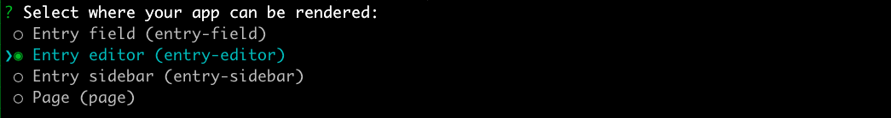
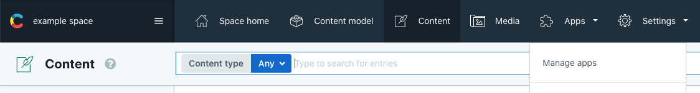
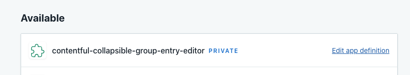

# Collapsible field groups app

The aim of this App is to simplify the process of editing complicated content types.
It provides a custom editor interface for Contentful.
The editor allows fields to be grouped together into collapsible sections. 

## Setup

To use this app, first ensure you have up to date versions of node.js and yarn installed then in your terminal run:
``` sh
yarn && yarn configure
```
this will install the required dependencies, then walk you through the process of setting up your app with Contentful.

When asked to `Select where your app can be rendered` please select `Entry Editor`.


Once your app definition is created you can run the code with

``` sh
yarn start
```

then navigate to the app management section of your contentful space and select the app to install it.



You will be presented with install screen - hit install at the top right of the screen, then you will be able to configure the app.


------------------------------------------------------------------------------------------

This project was bootstrapped with [Create React App](https://github.com/facebook/create-react-app).

## Available Scripts

In the project directory, you can run:

### `yarn configure`

This will help you configure your development environment, it will log into
contentful if necessary, and then help you choose the space and environment you
wish to use with your app.


### `yarn start`

Creates or updatse your app definition in contentful, and runs the app in the 
development mode.
Open [http://localhost:3000](http://localhost:3000) to view it in the browser.

The page will reload if you make edits.<br />
You will also see any lint errors in the console.


### `yarn start local`

Runs the app in the development mode.<br />
Open [http://localhost:3000](http://localhost:3000) to view it in the browser.

The page will reload if you make edits.<br />
You will also see any lint errors in the console.

### `yarn test`

Launches the test runner in the interactive watch mode.<br />
See the section about [running tests](https://facebook.github.io/create-react-app/docs/running-tests) for more information.

### `yarn run build`

Builds the app for production to the `build` folder.<br />
It correctly bundles React in production mode and optimizes the build for the best performance.

The build is minified and the filenames include the hashes.<br />
Your app is ready to be deployed!

See the section about [deployment](https://facebook.github.io/create-react-app/docs/deployment) for more information.


### `yarn run eject`

**Note: this is a one-way operation. Once you `eject`, you can’t go back!**

If you aren’t satisfied with the build tool and configuration choices, you can `eject` at any time. This command will remove the single build dependency from your project.

Instead, it will copy all the configuration files and the transitive dependencies (webpack, Babel, ESLint, etc) right into your project so you have full control over them. All of the commands except `eject` will still work, but they will point to the copied scripts so you can tweak them. At this point you’re on your own.

You don’t have to ever use `eject`. The curated feature set is suitable for small and middle deployments, and you shouldn’t feel obligated to use this feature. However we understand that this tool wouldn’t be useful if you couldn’t customize it when you are ready for it.

## Learn More

You can learn more in the [Create React App documentation](https://facebook.github.io/create-react-app/docs/getting-started).

To learn React, check out the [React documentation](https://reactjs.org/).
